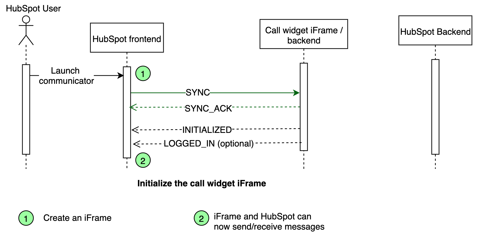
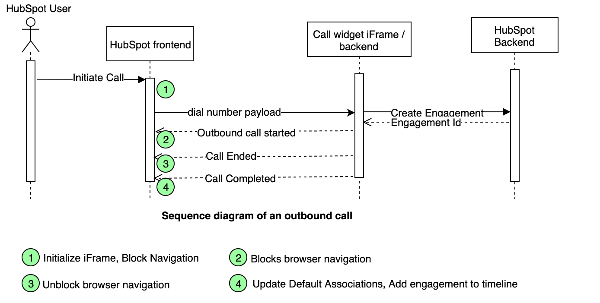

## Overview

[](https://travis-ci.org/HubSpot/calling-extensions-sdk)
[](http://npmjs.com/@hubspot/calling-extensions-sdk)

Calling Extensions SDK enables 3rd party VOIP providers or enterprise calling systems seamlessly integrate their CTI (referred to as call widget) with HubSpot for outbound calling. Call Widget is rendered inside HubSpot UI and a lightweight wrapper around HTML5 postMessage API facilitates cross-origin communication between the widget and HubSpot.

## Getting Started

1. [Create](https://developers.hubspot.com/docs/faq/how-do-i-create-an-app-in-hubspot) a HubSpot application and [setup a test](https://developers.hubspot.com/docs/faq/how-do-i-create-a-test-account) portal
2. [Integrate](https://github.com/HubSpot/calling-extensions-sdk#integrate-calling-extensions-sdk) the Calling Extensions SDK with your call widget.
3. [Test](https://github.com/HubSpot/calling-extensions-sdk#test-your-app-in-local-environment) your app in local environment
4. [Get your app](https://github.com/HubSpot/calling-extensions-sdk#get-your-app-ready-for-production) ready for production
5. [Publish your app](https://github.com/HubSpot/calling-extensions-sdk#publish-application-to-the-hubspot-marketplace) to the HubSpot marketplace.

## Integrate Calling Extensions SDK

### Get the Calling Extensions SDK

Download the SDK using npm or yarn

```shell
npm install -s @hubspot/calling-extensions-sdk
```

#### Running the demo Calling Extensions Widget project

##### Run the demo widget project

```shell
# install npm build dependencies and start the demo project
# The following commands will automatically start the browser on the demo page.
cd /demo
npm start
```

##### Launch the demo widget from HubSpot

Navigate to the a contact/company page in HubSpot and launch calling, the demo widget should load inside an iFrame.

### Using the Calling Extensions SDK

The Calling Extensions SDK exposes a simple API for HubSpot and a Soft Phone to exchange messages. The messages are sent through methods exposed by SDK and received through eventHandlers.

#### Create an instance

```js
import CallingExtensions from "@hubspot/calling-extensions-sdk";

const options = {
  // Whether to log various inbound/outbound messages to console
  debugMode: true | false,
  // eventHandlers handle inbound messages
  eventHandlers: {
    onReady: () => {
      /* HubSpot is ready to receive messages. */
    },
    onDialNumber: event => {
      /* Dial a number */
    },
    onEngagementCreated: event => {
      /* HubSpot has created an engagement for this call. */
    },
    onVisibilityChanged: event => {
      /* Call widget's visibility is changed. */
    }
  }
};

const extensions = new CallingExtensions(options);
```

#### Sending the messages to HubSpot

:warning: _Wait for the onReady event before sending sending any messages to HubSpot._

<details>
 <summary>initialized </summary>
 <p>

```js
// Sends a message indicating that the soft phone is ready for interaction.
const payload
{
  // Whether a user is logged-in
  isLoggedIn: true|false,
  // Optionally send the desired widget size
  sizeInfo: {
    height: number,
    width: number
  }
}

extensions.initialized(payload);

```

 </p>
</details>

<details>
 <summary>userLoggedIn </summary>
 <p>

```js
// Sends a message indicating that user has logged in
// This message is only needed when user isn't loged in when initialized
extensions.userLoggedIn();
```

</p>
</details>

<details>
 <summary>userLoggedOut</summary>
 <p>

```js
// Sends a message indicating that user has logged out
extensions.userLoggedOut();
```

</p>
</details>

<details>
 <summary>outgoingCall</summary>
 <p>

```js
// Sends a message to notify HubSpot that an outgoing call has started.

const callInfo = {
  phoneNumber: string, // optional unless call is initiated by the widget
  createEngagement: true // whether HubSpot should create an engagement for this call
};
extensions.outgoingCall(callInfo);
```

</p>
</details>

<details>
 <summary>callAnswered</summary>
 <p>

Sends a message to notify HubSpot that an outgoing call is being answered.

```js
extensions.callAnswered();
```

</p>
</details>

<details>
 <summary>callEnded</summary>
 <p>

```js
// Sends a message to notify HubSpot that the call has ended.
// After receiving the call ended event, the user can navigate away, can close the call widget.
extensions.callEnded();
```

</p>
</details>

<details>
 <summary>callCompleted</summary>
 <p>

```js
// Sends a message to notify HubSpot that the call has completed.
// After receiving the call completed event, HubSpot will
//   1) insert the engagement into the timeline
//   2) set the default associations on the engagement
//   3) closes the the widget unless `hideWidget` is set to false.
const data = {
  engagementId: number,
  hideWidget: boolean // (optional) defaults to true
};
extensions.callCompleted(data);
```

</p>
</details>

#### Receiving messages from HubSpot

</p>
</details>

<details>
 <summary>onDialNumber</summary>
 <p>

```js
// Message indicating that user has triggered an outbound call
onDialNumber(data) {
  const {
    /* The phone nubmer to dial */
    phoneNumber: string,
    /* The id of the logged in user.   */
    ownerId: number,
    /* HubSpot object Id of the phoneNumber */
    objectId: number,
    /* HubSpot  object type of the phoneNumber */
    objectType: CONTACT | COMPANY
   } = data;
    ...
  }
```

</p>
</details>

<details>
 <summary>onEngagementCreated</summary>
 <p>

```js
  // Message indicating that HubSpot has created
  onEngagementCreated(data) {
    const {
      /* A HubSpot created engagement id. */
      engagementId: number,
    } = data;
      ...
  }
```

</p>
</details>

<details>
 <summary>onVisibilityChanged</summary>
 <p>

```js
  // Message indicating if user has minimized/hide the call widget
  onVisibilityChanged(data) {
    const { isMinimized, isHidden } = data;
    ...
  }
```

</p>
</details>

<details>
 <summary>defaultEventHandler</summary>
 <p>
 
 ```js
  // Default handler for events.
  defaultEventHandler(event) {
    console.info("Event received. Do you need to handle it?", event);
  }
```

</p>
</details>

## Typical message flow between the call widget and HubSpot

### Initializing the call widget

The following messages are exchanged when a call widget is instantiated.


Once the widget iFrame is created, Hubspot send the SYNC message to the widget after iFrame is loaded and repetedly send this message until it receives the SYNC_ACK response from the widget. If the SYNC_ACK response isn't received within 30 seconds, the widget is marked as failed. Note that sending SYNC/SYNC_ACK messages are handled by the framework. Once the widget and host page are synchronized, the frameworks triggers the ready event.

The call widget should wait for the ready event from the framework and send the initialized event to HubSpot. At this point, the messages can be exchanged between the call widget and HubSpot.

### Outbound call

The following messages are exchanged when user initiates a call.

Hubspot ensures the call widget is logged in before sending in a dial number event - if the widget is not logged in, an alert is shown in HubSpot's UI.

Here is description of events:

1. **Dial number** - HubSpot sends the dial number event.
2. **Outbound call started** - Widget notifies HubSpot when the call is started.
3. **Create engagement** - HubSpot creates an engagement with minimum information if requested by the widget.
4. **Engagement created** - HubSpot created an engagement.
5. **EngagementId sent to Widget** - HubSpot sends the engagementId to the widget.
6. **Call ended** - Widget notifies when call is ended.
7. **Call completed** - Widget notifies when user is done with the widget user experience.
8. **Update engagement** - Widget fetches the engagment by the engagementId, merges and updates the engagement with additional call details. [Call engagement overview](https://developers.hubspot.com/docs/methods/engagements/engagements-overview), [Docs on updating the engagement](https://developers.hubspot.com/docs/methods/engagements/update_engagement-patch)

## Test your app in local environment

While you're in the process of building your application, you can manually set the iframe URL for your browser by setting a localStorage value. This will allow you to set a localhost URL for local testing.

To set the value, open the developer tools for your browser, and run the following JavaScript command in the developer console:

```js
// Add the following localstorage override for demo widget
localStorage.setItem(
  "LocalSettings:Sales:CallingExtensions",
  '{"name": "Demo widget", "url": "https://localhost:9025/"}'
);
```

The name value will be the title that appears in the header of the calling widget, and the url will be the URL used for the iframe. While this item is set, the name you set will appear as an option for the call provider when you click the call icon, and the calling widget will use the iframe url you set.

## Get your app ready for production

In order to launch the calling extensions iFrame for end users, HubSpot requires the following iFrame parameters.

```js
{
  name: string /* The name of your calling service to display to users. */,
  url: string  /* The URL to your phone/calling UI, built with the Calling Extensions */,
  width: number /* The iFrame's width */,
  height: number /* The iFrame's height */,
  isReady: boolean /* Whether the widget is ready for users (default=true) */
}
```

Using your favorite API tool (postman/etc.), send this payload to our settings API. Please get the APP_ID of your calling widget application and your dev portal's [HUBSPOT_API_KEY](https://app.hubspot.com/l/api-key/)

```shell
# Example payload to add the call widget app settings
curl --request POST \
  --url 'https://api.hubapi.com/crm/v3/extensions/calling/APP_ID/settings?hapikey=HUBSPOT_API_KEY' \
  --header 'accept: application/json' \
  --header 'content-type: application/json' \
  --data '{"name":"demo widget","url":"https://mywidget.com/widget","height":600,"width":400,"isReady":true}'

# Note that this endpoint also support GET and DELETE
```

The isReady flag indicate whether the widget is ready for production. This flag should be set to false during testing. Note that this flag (or any other field) can be overwritten through localStorage.

```js
/* Override the isReady flag for "Demo widget" */
localStorage.setItem(
  "LocalSettings:Sales:CallingExtensions",
  '{"name": "Demo widget", "isReady": true}'
);
```

## Publish application to the HubSpot marketplace

The final step once your app is setup is to list in the HubSpot marketplace. You can find more details [here](https://developers.hubspot.com/submit-an-application-to-the-marketplace) . You can also choose to not list in the marketplace if this application is for your internal use only.

# FAQs

### App

<details>
 <summary>How is user authentication handled?</summary>
 <p>
    The call widget should handle authentication.
</p>
</details>

<details>
 <summary>Is Calling Extensions hosted on a CDN?</summary>
 <p>
    No. The calling entensions is very small and should be bundled with the call widget.  If bundling the file is not possible, the npm package includes a compiled UMD bundle that can be included into HTML (../node_modules/@hubspot/calling-extensions-sdk/dist/main.js).
</p>
</details>

<details>
 <summary>When an engagement should be created vs updated.</summary>
 <p>
    A user can initiate a call from inside the HubSpot UI and outside of the HubSpot UI (e.g. mobile app/redirected number/etc.)  If a call is initiated from within HubSpot UI, HubSpot will create a call engagement and send the engagement to the call widget.  Once the call finishes, the call widget can update this engagement with additional call details.  If a call is initiated outside of HubSpot UI, the widget should create the call engagement. 
</p>
</details>

<details>
 <summary> What scopes are required as a part of the integration?</summary>
 <p>
    Add contacts and timeline scopes. These scopes ensure your application has access to contacts and the ability to create and update call engagements in the CRM.
</p>
</details>

<details>
 <summary> Can this functionality be added to an already existing application in the marketplace or do I create a new app? </summary>
 <p>
    If you already have an existing app that serves the calling use case then you can directly add this functionality to your existing app. All customers who already have your app installed with get access to this new functionality without having to install the app again. </p>
</details>

<details>
 <summary> Can I integrate my existing soft phone application in the SDK? </summary>
 <p>
    Yes, integrating your existing soft phone application should be very easy. Just follow the steps in the documentation above to have your application up and running. </p>
</details>

<details>
 <summary> Does the SDK support inbound calling? </summary>
 <p>
    The current SDK does not support inbound calling. We understand this is a big feature request and will have more to share about our plans for inbound calling in the future. </p>
</details>

<details>
 <summary> How can users install the integration? </summary>
 <p>
    Users can install the app is one of two ways 1) Search for the app in the HubSpot Marketplace and follow the steps 2) If the app is not listed in the marketplace, they can install it by clicking on the OAuth URl (can be found in your developer portal under app settings) </p>
</details>

<details>
 <summary> Once installed, how can users access the app integration? </summary>
 <p>
    Once the app is installed users can access the app by going to any record in the HubSpot CRM and clicking on the call button. Users will then be presented an option to use the installed calling integration or even switch to native HubSpot calling functionality if needed. </p>
</details>

<details>
 <summary> Can users use multiple integrations at the same time? </summary>
 <p>
    Yes, users can use multiple 3rd party calling integrations at the same time. They can use the provider switcher presented after clicking on the call button to seamlessly switch between providers. </p>
</details>

<details>
 <summary> Can free users install app integrations? </summary>
 <p>
    No, this feature is available on to paid customers. At this point in time, users will be able to install the app but will not be able to access it. </p>
</details>

<details>
 <summary> How can users install the integration? </summary>
 <p>
    The current SDK does not support inbound calling. We understand this is a big feature request and will have more to share about our plans for inbound calling in the future. </p>
</details>

<details>
 <summary> If a user already has my app installed, does the integration automatically show up? </summary>
 <p>
    Yes, if a user already has installed your app, and you are updating the same app with the calling extensions the integration will automatically show up. Currently, there is no way for the developer to enable the call widget only to a subset of customers.</p>
</details>

<details>
 <summary> Can any user install or uninstall an app? </summary>
 <p>
    No. Only users who have necessary permissions can install and uninstall an app. These permissions can be found in HubSpot portal settings page in the "Users & Teams" tab. </p>
</details>

<details>
 <summary> Need help with the SDK? </summary>
 <p>
    Head over to the <a href="https://community.hubspot.com/t5/APIs-Integrations/bd-p/integrations" target="_blank">HubSpot developer support forum</a> and post your questions. Someone from our developer support team will answer your queries. </p>
</details>
